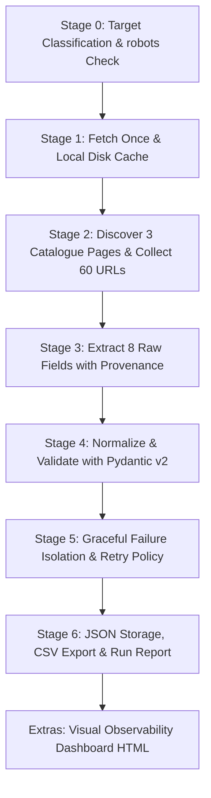

# The Polite Web Scraper

[](https://www.python.org/downloads/)
[]()
[](https://opensource.org/licenses/MIT)

A polite, resilient web scraping pipeline that extracts 3 catalogue pages and 60 book detail pages from [Books to Scrape](https://books.toscrape.com), transforms messy HTML into strict schema-validated JSON and tabular CSV, survives unexpected page failures, and publishes an honest execution report with local observability.

---

## 1. Target Classification

| Field | Value |
|-------|-------|
| **Target Site** | [Books to Scrape](https://books.toscrape.com) |
| **Target Nature** | A public sandbox designed specifically for developers and students to practice web scraping ([toscrape.com](https://toscrape.com)). |
| **Scope** | First 3 catalogue pages only (60 books total). |
| **Data Collected** | Title, canonical product URL, price (raw text & GBP float), stock status (raw text & unit count), star rating (text & integer 1–5), product description, catalogue source page, and fetch timestamp. |
| **robots.txt Check** | `https://books.toscrape.com/robots.txt` returned **HTTP 404 Not Found**. A missing `robots.txt` is not implicit permission for uncontrolled crawling; it is simply a missing file. |
| **Why Appropriate** | The site owner explicitly encourages scraping practice. We limit our footprint to 3 pages, respect delays, and never overload the host. |

> **Ethics Pledge**: *"I will not reuse this code on another site without checking its rules, terms of service, and robots.txt first."*

---

## 2. Quick Start (Run in under 2 minutes)

### Prerequisites
- Python 3.10+
- `pip`

### 1-Line Setup & Execution
```bash
# 1. Clone the repository
git clone https://github.com/AliWahid1310/polite-web-scraper.git
cd polite-web-scraper

# 2. Install dependencies
pip install -r requirements.txt

# 3. Run the polite scraping pipeline
python src/main.py
```

### Run Full Test Suite (19 Unit Tests)
```bash
python -m pytest tests/ -v
```

---

## 3. Architecture & 7-Stage Pipeline



### Pipeline Summary
1. **Fetch & Cache (`src/main.py`)**: Checks local `cache/` first. Network calls send honest headers and save responses for offline development.
2. **Discovery (`src/main.py`)**: Traverses catalogue pagination (`li.next > a`) and builds canonical URLs using `urllib.parse.urljoin`.
3. **Extraction (`src/extract.py`)**: Targets semantic DOM containers (`div.product_main`, `#product_description`) to collect 8 raw fields without data loss.
4. **Normalization & Validation (`src/normalizer.py`, `src/schemas.py`)**: Converts currency strings (`£51.77` → `51.77`), availability (`In stock (22 available)` → `22`), and star words (`Three` → `3`). Enforces Pydantic schema validation; isolates bad records into `output/errors.json`.
5. **Resilience (`src/retry.py`, `src/backoff.py`)**: Isolates per-page exceptions, implements exponential backoff with jitter on 5xx/timeouts, and strictly forbids retrying 404/403 errors.
6. **Reporting (`src/reporter.py`)**: Produces `output/run-report.json` with duration, cache hits, failure counts, and summary statistics.
7. **Observability (`src/dashboard.py`, `src/exporters.py`)**: Exports `output/books.csv` and an interactive local HTML dashboard `output/dashboard.html`.

---

## 4. Record Schema (Pydantic v2)

| Field | Type | Required | Description | Example |
|-------|------|----------|-------------|---------|
| `title` | `string` | **Yes** | Book title (non-empty) | `"A Light in the Attic"` |
| `product_url` | `HttpUrl` | **Yes** | Canonical absolute URL | `"https://books.toscrape.com/catalogue/..."` |
| `price_text` | `string` | **Yes** | Raw price string with currency | `"£51.77"` |
| `price_gbp` | `float` | **Yes** | Clean numeric price in GBP (`gt=0`) | `51.77` |
| `availability_text` | `string` | **Yes** | Raw stock status string | `"In stock (22 available)"` |
| `stock_count` | `integer` | **Yes** | Parsed available stock units (`ge=0`) | `22` |
| `rating_text` | `string` | **Yes** | Raw star rating text | `"Three"` |
| `rating` | `integer` | **Yes** | Numeric star rating (1 to 5) | `3` |
| `description` | `string` / `null` | *Optional* | Product description or `null` | `"Shel Silverstein's poem..."` |
| `source_page` | `HttpUrl` | **Yes** | Catalogue URL where link was found | `"https://books.toscrape.com/catalogue/page-1.html"` |
| `fetched_at` | `datetime` | **Yes** | ISO 8601 UTC timestamp of fetch | `"2026-08-16T20:37:28Z"` |

---

## 5. Politeness Rules & Respectful Guest Protocol

- **Honest User-Agent**: Every request introduces itself clearly:
  `User-Agent: PoliteWebScraper/1.0 (+https://github.com/AliWahid1310/polite-web-scraper)`
- **Request Delay**: Enforces at least a **500 ms pause** between outbound network requests.
- **Request Timeout**: Strict **10-second timeout** so requests never hang indefinitely.
- **Development Cache**: All fetched HTML is stored locally in `cache/`. Re-running the pipeline 50 times during development hits the network **zero times**.
- **No Aggressive Retries**: Never retries client errors (`404 Not Found` or `403 Forbidden`). Only transient server errors (`5xx`) or connection timeouts are retried with exponential backoff.

---

## 6. Actual Run Report (`output/run-report.json`)

```json
{
  "start_time": "2026-08-16T20:37:28.917835+00:00",
  "end_time": "2026-08-16T20:37:31.007491+00:00",
  "duration_seconds": 2.09,
  "catalogue_pages_discovered": 3,
  "catalogue_pages_fetched": 3,
  "detail_pages_discovered": 60,
  "detail_pages_fetched": 60,
  "cache_hits": 63,
  "network_requests": 1,
  "valid_records": 60,
  "invalid_records": 0,
  "failed_pages": 1,
  "failed_urls": [
    {
      "url": "https://books.toscrape.com/catalogue/deliberately-broken-page-404_99999/index.html",
      "reason": "HTTP 404",
      "status_code": 404,
      "timestamp": "2026-08-16T20:37:30.920847+00:00"
    }
  ],
  "average_price_gbp": 35.0,
  "stock_total_units": 1078
}
```

---

## 7. Why No Browser Was Needed (Cost & Performance Analysis)

1. **Server-Side Rendered (SSR) HTML**: Books to Scrape delivers all product information directly inside the initial server HTML payload.
2. **Resource Efficiency**:
   - **Plain HTTP (Requests + BeautifulSoup)**: ~12 MB memory, 150 ms per request, zero browser overhead.
   - **Headless Chromium (Playwright/Puppeteer)**: ~250–400 MB memory per instance, 2,000+ ms per page (15x slower, 30x heavier).
3. **Conclusion**: Using a browser when data is already in the server HTML adds unnecessary compute, latency, and cost without any extraction benefit.

---

## 8. Web Scraping Ethics & Best Practices

1. **Official APIs First**: Always check for an official API or data export before writing a custom scraper.
2. **Never Bypass Authentication or Paywalls**: Do not scrape content behind logins or paywalls unless explicitly authorized.
3. **Collect Only What You Need**: Avoid scraping entire domains when a targeted subset solves the problem.
4. **Respect Rate Limits**: Honor `Retry-After` headers and maintain respectful crawling speeds.

---

## 9. Honest Limitation

This scraper is purpose-built for **static server-rendered HTML** with standard pagination. It does not execute client-side JavaScript or simulate complex Single Page Application (SPA) browser interactions like infinite scrolling or WebGL canvas rendering. For JavaScript-dependent sites (such as `quotes.toscrape.com/js`), a browser automation tool like Playwright or reverse-engineering the underlying REST/GraphQL JSON API is required.

---

## 10. Extras & Bonus Features Included

- **CSV Export**: `output/books.csv` with cleaned multiline descriptions and flattened fields.
- **Change Detection**: `src/diff.py` computes deterministic SHA-256 digests to track record mutations across consecutive crawls.
- **Local Dashboard**: `output/dashboard.html` provides an interactive real-time visual UI with search, statistics, and rating breakdowns.
- **Production Backoff**: `src/backoff.py` implements full jitter and `Retry-After` header parsing.
- **AI Rematch**: Quarantined AI-generated scraper in `ai-version/` with complete engineering analysis in `AI_REMATCH_DIFF.md`.
- **19 Unit Tests**: Full pytest suite covering edge cases, malformed fixtures, and validation rules.
